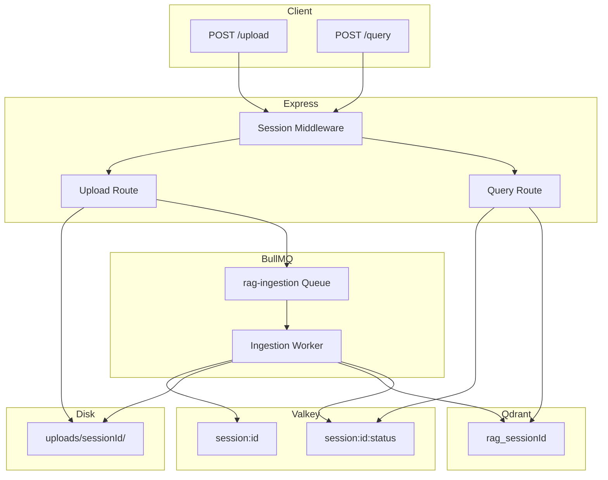

# RAG Pipeline Implementation Plan

## Current State Assessment

| Phase | Status | Notes |

|-------|--------|-------|

| Phase 0 (Session) | Done | [session.js](src/middleware/session.js) implements Valkey TTL, x-session-id, req.sessionId |

| Phase 1 (Upload) | Done | [multerConfig.js](src/utils/multerConfig.js) session-scoped PDF uploads; [rag.route.js](src/v1/components/rag/rag.route.js) POST /v1/rag/upload |

| Cleanup | Incomplete | [cleanup.js](src/utils/cleanup.js) truncated at line 10; not wired to server |

| Phase 2 (Ingestion) | Not started | [ingestion.queue.js](src/queues/ingestion.queue.js) is empty |

| Phase 2.5 (Status) | Not started | |

| Phase 3 (Query) | Not started | |

**Minor gap**: [session.js](src/middleware/session.js) reuses an expired sessionId (recreates key). Plan says "generate new one if expired." Optional fix: when `!exists` and `sessionId` was provided by client, treat as expired and generate new UUID.

---

## Phase 0/1 Fixes (Minimal)

- **Optional**: In [session.js](src/middleware/session.js), if client sends `x-session-id` but Valkey key does not exist, generate a new sessionId instead of reusing the old one (aligns with "expired = invalid").
- **Route path check**: Upload is at `POST /v1/rag/upload` (routes: `/v1` + `/rag` + `/upload`). Confirm this matches your frontend.

---

## Phase: Complete Cleanup Logic

**File**: [src/utils/cleanup.js](src/utils/cleanup.js)

Finish `cleanupOrphanedUploads()`:

```js
// For each dir in uploads/, check Valkey session:<dirName>
// If valkey.exists(`session:${dirName}`) === 0, delete the folder recursively
```

- Use `fs.readdirSync`, `valkey.exists`, `fs.rmSync(path, { recursive: true })`.
- Add `cleanupOrphanedQdrantCollections()` stub for Phase 2 (no-op until Qdrant is integrated).

**Wire cleanup** in [server.js](server.js):

- On startup: call `cleanupOrphanedUploads()` after app is ready.
- Set `setInterval(cleanupOrphanedUploads, 10 * 60 * 1000)` for periodic run.

**Note**: Cleanup must not block startup. Use `.catch(console.error)` on the async cleanup.

---

## Phase 2: BullMQ Ingestion Pipeline

### 2.1 Dependencies and Config

- Add: `ioredis` (BullMQ requires it; Valkey is Redis-compatible), `@qdrant/js-client-rest`, `pdf-parse` (or `pdfjs-dist` for PDF text extraction).
- Add to [env.config.js](env.config.js): `qdrantUrl`, `embeddingProvider` (e.g. `openai`), `embeddingApiKey`, `llmProvider`, `llmApiKey`. Support at least `openai` initially.
- **Valkey client**: BullMQ expects `ioredis`. Create [src/utils/valkeyConnection.js](src/utils/valkeyConnection.js) using `new IORedis(config.valkeyUrl)` and export for BullMQ. Keep [valkeyClient.js](src/utils/valkeyClient.js) for session/cache (or migrate session to ioredis and use single client).

### 2.2 Queue and Worker Setup

**File**: [src/queues/ingestion.queue.js](src/queues/ingestion.queue.js)

- Create BullMQ `Queue` named `rag-ingestion` with connection from `valkeyConnection`.
- Export `addIngestionJob(sessionId, filePath)`.
- Optionally set `defaultJobOptions`: `attempts: 3`, `backoff: { type: 'exponential', delay: 2000 }`.

**New file**: `src/workers/ingestion.worker.js`

- Create BullMQ `Worker` for `rag-ingestion`.
- Job data: `{ sessionId, filePath }`.
- **Before processing**: `if (!(await valkey.exists(`session:${sessionId}`))) return` (abort, no retry).
- **Processing**: Parse PDF (pdf-parse) -> extract text -> chunk (e.g. 500 chars, 50 overlap) -> generate embeddings (via provider abstraction) -> upsert to Qdrant collection `rag_${sessionId}` -> delete PDF with `fs.unlinkSync(filePath)`.
- Create collection if not exists. Use configurable embedding dimension (e.g. 1536 for OpenAI).

### 2.3 Provider Abstraction (Embeddings + LLM)

**New file**: `src/utils/embeddingProvider.js`

- `embed(texts: string[]): Promise<number[][]>`.
- Switch on `config.embeddingProvider`: `openai` -> `openai.embeddings.create` with `text-embedding-3-small`. Extensible for future providers.

**New file**: `src/utils/llmProvider.js`

- `generate(messages, options): Promise<string>`.
- Switch on `config.llmProvider`: `openai` -> `openai.chat.completions.create` with `gpt-4o-mini`. Extensible.

### 2.4 Qdrant Client

**New file**: `src/utils/qdrantClient.js`

- Create `QdrantClient` from config.
- Export helpers: `ensureCollection(name, dimension)`, `upsertPoints(collection, points)`, `search(collection, vector, limit)`, `deleteCollection(name)` (for cleanup).

### 2.5 Trigger Ingestion on Upload

In [rag.controller.js](src/v1/components/rag/rag.controller.js) (or a thin service), after successful upload:

- For each `req.files`, call `addIngestionJob(req.sessionId, file.path)`.
- Set Valkey `session:<id>:status` to `ingesting` (or keep as-is if Phase 2.5 is done in same pass).

---

## Phase 2.5: Session Status (Optional)

**Valkey keys**: `session:<id>:status` = `uploading` | `ingesting` | `ready`.

- **Upload controller**: Set `uploading` when upload starts; after adding jobs, set `ingesting`.
- **Ingestion worker**: When last file for a session is done (or use a simple heuristic), set `ready`.
- **Endpoint**: `GET /v1/rag/status` reads `session:<id>:status` (sessionId from `x-session-id`), returns `{ status }`.

---

## Phase 3: RAG Query Endpoint

**Endpoint**: `POST /v1/rag/query`

**Request body**: `{ question, chatHistory?: [{ role, content }] }`

**Flow**:

1. Validate session (already done by middleware).
2. Check `session:<id>:status` === `ready`; if not, return 400 with message like "Documents still ingesting".
3. Load Qdrant collection `rag_<sessionId>`; if missing, return 400.
4. Embed `question` via `embeddingProvider.embed([question])`.
5. Qdrant search: `search(collection, queryVector, topK: 5)`.
6. Build prompt: system + retrieved chunks + chatHistory + question.
7. Call `llmProvider.generate(messages)`.
8. Return `{ answer }`.

**Chat history**: Client sends it; server never persists it. Include in LLM messages as user/assistant turns.

---

## Docker and Project Structure

**docker-compose.yml**: Add Qdrant service:

```yaml
qdrant:
  image: qdrant/qdrant
  ports:
    - "6333:6333"
```

**New/updated files**:

- `src/utils/valkeyConnection.js` (ioredis for BullMQ)
- `src/utils/qdrantClient.js`
- `src/utils/embeddingProvider.js`
- `src/utils/llmProvider.js`
- `src/workers/ingestion.worker.js`
- Update `src/queues/ingestion.queue.js`
- Update `src/utils/cleanup.js` (complete + Qdrant collection delete when session expires)
- Update `src/v1/components/rag/rag.controller.js` (trigger jobs)
- New `rag.controller.js` handler + route for `POST /query`, `GET /status`

**Worker process**: Run worker separately (e.g. `node src/workers/ingestion.worker.js`). Add script in `package.json`: `"worker": "node src/workers/ingestion.worker.js"`.

---

## Architecture Overview



---

## Implementation Order

1. Complete cleanup + wire to server
2. Add ioredis, Qdrant, pdf-parse, OpenAI deps; extend env.config
3. Create valkeyConnection, qdrantClient, embeddingProvider, llmProvider
4. Implement ingestion queue + worker
5. Trigger ingestion from upload controller
6. Phase 2.5: Status endpoint and status updates in worker
7. Phase 3: Query endpoint
8. Cleanup: extend cleanup to delete Qdrant collection when session gone
9. Docker: add Qdrant; document worker startup